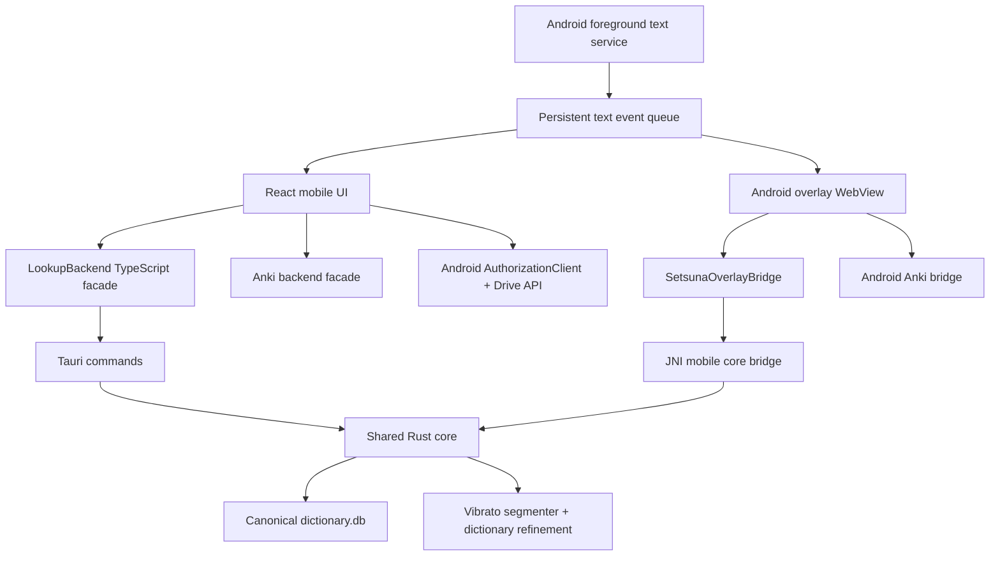

# Setsuna Mobile 2.0: техническое задание

Статус: основная мобильная архитектура реализована; документ сохраняется как технический контракт для дальнейшей доводки и ручного тестирования.

Дата последнего обновления: 1 сентября 2026.

Это ТЗ заменяет первый архитектурный набросок из `docs/mobile-roadmap.md`. Оно рассчитано на пошаговую реализацию другой, менее крупной моделью. Каждый этап должен быть маленьким, проверяемым и завершаться ручным тестом владельца проекта.

## 1. Цель

Сделать Android-версию Setsuna полноценным мобильным рабочим пространством для чтения и майнинга, а не уменьшенной копией desktop-интерфейса.

Основные сценарии:

1. Телефон получает текст из WebSocket-источника, Android Share, `PROCESS_TEXT`, буфера или ручного ввода.
2. Каждая строка автоматически делится на слова и устойчивые выражения.
3. Пользователь нажимает на подсвеченный сегмент и сразу получает полный локальный lookup.
4. Из lookup можно создать карточку в AnkiDroid с теми же полями, что на ПК.
5. Yomitan-словари импортируются локально без жёсткого лимита размера и не блокируют интерфейс.
6. Бэкапы, настройки и словарная база совместимы с desktop Setsuna через Google Drive.
7. Поверх других Android-приложений можно показать гибкое окно только с последней полученной строкой. В этом окне также работают сегментация, lookup и Anki.

## 2. Обязательные продуктовые решения

- Только Android. iOS не входит в это ТЗ.
- OCR и Accessibility Service не входят в первую публичную версию.
- Реального времени через Google Drive нет. Drive используется для явных бэкапов и восстановления.
- Основной lookup всегда локальный. Интернет не нужен после загрузки словарей.
- Текст на экране нельзя менять ради нормализации. Нормализованная копия используется только для поиска.
- Все позиции в тексте между Rust и TypeScript измеряются в Unicode code points, не в байтах и не в UTF-16 индексах.
- Одна строка и один и тот же сегмент не должны повторно открывать lookup при небольшом движении пальца или повторном рендере.
- Overlay запускается только явным действием пользователя и всегда показывает системное уведомление.
- После каждого этапа модель останавливается и ждёт ручного теста пользователя.

## 3. Что уже есть в проекте

### 3.1 Frontend

- Мобильная разметка находится в `src/components/AppLayout.tsx`, компонент `MobileLayout`.
- Текстовая лента уже использует `TextContainer` и виртуализацию из `@tanstack/react-virtual`.
- Полный renderer словарных результатов находится в `src/components/Lookuper.tsx`.
- Мобильный lookup уже умеет открываться как bottom sheet.
- Anki facade находится в `src/utils/anki.ts`.
- Google Drive API находится в `src/utils/gdrive.ts`.
- Мобильный WebSocket сейчас конфигурируется как источник `mobile-ws`.
- Отдельный экран ручного lookup сейчас режет строку функцией `tokenizeLookupText` из `src/utils/appRuntime.ts`.

### 3.2 Rust

- Desktop-команды находятся в `src-tauri/src/main.rs`.
- Android-команды находятся в `src-tauri/src/lib.rs`.
- Полный desktop importer находится в `src-tauri/src/dictionary_import.rs`.
- На Android уже есть команды `lookup_word`, `scan_cursor`, `get_furigana`, `import_dictionaries`, загрузка и скачивание `dictionary.db`.
- Деинфлекция загружается из `src-tauri/src/deinflect.json`.

### 3.3 Android

- `MainActivity.kt` создаёт Tauri WebView и добавляет `SetsunaAnkiDroid`.
- `AnkiDroidBridge.kt` умеет читать колоды и модели, добавлять заметки и передавать скриншот через `FileProvider`.
- `AndroidManifest.xml` пока объявляет только интернет и доступ к провайдеру AnkiDroid.
- Overlay, foreground service, Share Target и `PROCESS_TEXT` отсутствуют.

### 3.4 Подключённое тестовое устройство

- Производитель: OnePlus.
- Модель: CPH2767.
- Android: 16.
- API: 36.
- ADB serial: `3B661W027RW00000`.
- ADB: `C:\Users\Serichka\AppData\Local\Android\Sdk\platform-tools\adb.exe`.
- Команда разработки: `npm run android:dev:phone`.
- Скрипт уже использует `adb reverse tcp:1420 tcp:1420`, поэтому VPN телефона не должен мешать доступу к Vite через USB.

## 4. Найденные архитектурные проблемы

### 4.1 Ручной lookup режет японский по одному символу

`tokenizeLookupText` использует регулярное выражение, в котором японская ветка совпадает ровно с одним символом. Это не морфологическая сегментация.

### 4.2 Desktop и Android используют разные словарные схемы

Desktop importer пишет в:

- `entries`;
- `frequencies`;
- `pitches`;
- `pronunciations`;
- `dictionary_meta`.

Android importer пишет в упрощённую таблицу `dictionary`. Если в БД одновременно существуют `entries` и `dictionary`, Android lookup выбирает `entries` и игнорирует данные из `dictionary`. Это делает текущий обмен `dictionary.db` ненадёжным.

### 4.3 Lookup-логика продублирована

В `main.rs` и `lib.rs` находятся разные варианты lookup, furigana и импорта. Исправление одной платформы не гарантирует исправление второй.

### 4.4 Android Google OAuth использует неподходящий поток

Текущий Android UI поднимает loopback server, открывает браузер и предлагает копировать URL вручную. Loopback и manual copy/paste не должны быть основным Android-потоком. На Android нужно использовать Google `AuthorizationClient` с Android OAuth client и scope `drive.appdata`.

### 4.5 WebSocket живёт в WebView

При сворачивании приложения JavaScript и WebView могут быть приостановлены. Для устойчивой ловли текста и overlay соединение должно принадлежать Android foreground service.

### 4.6 Импорт на Android не отдаёт реальный прогресс

Frontend показывает стартовый progress object, но Android importer не эмитит desktop-события `import_progress`. На больших словарях пользователь не понимает, работает ли импорт.

### 4.7 Jardic не является примером клиентской морфологии

В приложенном HTML сервер уже отдал готовые сегменты вида `wlink-<position>-<count>`. JavaScript `showWord()` только подсвечивает выбранный сегмент и показывает строки словаря с той же позицией. Setsuna должна повторить именно этот контракт: backend отдаёт готовые диапазоны, frontend только отображает их.

## 5. UX мобильного приложения

## 5.1 Общая навигация

Первый экран всегда является рабочим экраном чтения. Отдельный рекламный home screen не нужен.

Нижняя навигация содержит четыре пункта:

1. `Текст`: текущая лента и живой источник.
2. `Ввод`: вставка предложения с Jardic-подобной сегментацией.
3. `Словари`: список, импорт, порядок и состояние словарей.
4. `Ещё`: Anki, Google Drive, overlay, интерфейс и диагностика.

Lookup не является отдельным пунктом навигации. Он открывается bottom sheet поверх контекста.

Окна текста выбираются нажатием на название текущего окна в верхней панели. Список открывается снизу и содержит:

- название;
- источник;
- количество символов;
- статус чтения;
- выбор привязанной колоды;
- создание, архивирование и удаление.

## 5.2 Экран `Текст`

Верхняя панель:

- цветная точка состояния источника;
- имя текущего окна;
- кнопка overlay;
- кнопка паузы или запуска;
- меню.

Основная область:

- полноэкранная виртуализированная лента;
- каждая строка переносится без горизонтального скролла;
- слова имеют очень лёгкое подчёркивание акцентным цветом, без набора отдельных тяжёлых капсул;
- выбранное слово получает сплошную синюю подсветку до закрытия lookup;
- служебные действия строки появляются через long press или меню, а не занимают постоянное место;
- новая строка плавно появляется снизу, но анимация не должна менять высоту уже измеренных виртуальных строк.

Пустое состояние показывает одно действие: `Подключить источник`.

## 5.3 Экран `Ввод`

Это мобильный аналог показанного Jardic-сценария.

Состав:

- многострочное поле ввода;
- кнопки `Вставить`, `Отправить в текст`, `Очистить`;
- ниже тот же текст, но уже разбитый на интерактивные сегменты;
- сегментация обновляется с debounce 120 мс;
- нажатие сегмента открывает lookup;
- строка и позиция выбранного слова передаются в Anki как контекст.

Отдельная кнопка `Искать весь текст` удаляется. Полный lookup запускается только для выбранного сегмента или для единственного введённого слова.

## 5.4 Lookup bottom sheet

Bottom sheet имеет три фиксированных положения: 46%, 74% и 94% высоты экрана.

В шапке:

- слово;
- чтение;
- аудио;
- закрытие;
- индикатор Anki.

Основная часть повторно использует текущий renderer `Lookuper`:

- деинфлекция;
- частотность;
- pitch accent;
- словарные статьи;
- структурированное содержимое Yomitan;
- смена найденного слова внутри определения;
- создание карточки;
- создание карточки со скриншотом, если источник скрина доступен;
- выбор колоды, если включён контекстный режим.

Поведение:

- тап по уже выбранному сегменту не перезапускает запрос;
- новый тап отменяет предыдущий запрос через request id;
- bottom sheet не закрывается при обновлении статуса Anki;
- результат lookup кэшируется по `databaseRevision + normalizedSurface + contextHash`;
- ошибки одной статьи не скрывают остальные словари.

## 5.5 Экран `Словари`

Сверху:

- общий размер базы;
- свободное место телефона;
- количество активных словарей;
- кнопка импорта.

Строка словаря:

- drag handle;
- цвет;
- название и revision;
- количество записей;
- переключатель активности;
- статус обновления;
- меню: обновить, заменить, удалить, сведения.

Во время импорта показывается один нижний progress sheet:

- текущий файл `2 / 6`;
- текущая часть архива;
- обработано записей;
- реальный прогресс чтения байтов;
- отдельный этап построения индексов;
- кнопка отмены до начала атомарной замены базы.

Lookup и чтение продолжают работать по старой БД, пока новая версия строится во временном файле.

## 5.6 Экран `Ещё`

Это полноэкранный список разделов, не длинная модалка:

- AnkiDroid;
- Google Drive;
- Окно поверх приложений;
- Источники текста;
- Интерфейс;
- Хранилище;
- Диагностика.

Каждый раздел открывается отдельным экраном с собственной верхней панелью и кнопкой назад.

## 5.7 Адаптивность

Обязательные размеры для проверки:

- 320 x 568 dp;
- 360 x 800 dp;
- 412 x 915 dp;
- landscape 800 x 360 dp;
- системный размер шрифта 100%, 130% и 160%.

Требования:

- использовать `100dvh`, а не `100vh`;
- учитывать `env(safe-area-inset-*)`;
- добавить `android:windowSoftInputMode="adjustResize"`;
- ни одна кнопка не попадает под status bar, navigation bar или клавиатуру;
- touch target не меньше 44 x 44 dp;
- длинное имя словаря, окна или колоды обрезается ellipsis, полное имя доступно в details;
- интерфейс не должен зависеть от ширины desktop settings.

## 6. Целевая архитектура



## 6.1 Shared Rust core

Создать модули:

```text
src-tauri/src/core/mod.rs
src-tauri/src/core/db.rs
src-tauri/src/core/import.rs
src-tauri/src/core/lookup.rs
src-tauri/src/core/deinflect.rs
src-tauri/src/core/segment.rs
src-tauri/src/core/furigana.rs
src-tauri/src/core/types.rs
```

`main.rs` и `lib.rs` должны только регистрировать платформенные команды и вызывать общий core. Копии lookup и importer из двух entry points удаляются только после parity tests.

## 6.2 TypeScript facade

Создать:

```text
src/features/lookup/types.ts
src/features/lookup/backend.ts
src/features/lookup/tauriBackend.ts
src/features/lookup/overlayBackend.ts
src/features/textIngress/types.ts
src/features/textIngress/store.ts
src/features/mobile/MobileShell.tsx
src/features/mobile/screens/*
```

UI не должен самостоятельно вызывать произвольные Tauri commands. Он работает через интерфейсы `LookupBackend`, `TextIngressStore`, `DriveBackend` и `AnkiBackend`.

## 7. Контракты данных

## 7.1 Событие входящего текста

```ts
export interface TextIngressEvent {
  id: string;
  sourceId: string;
  sourceType: 'websocket' | 'share' | 'process-text' | 'clipboard' | 'manual' | 'drive-restore';
  text: string;
  furigana?: unknown;
  receivedAtMs: number;
  sequence?: number;
  targetTabId?: number;
  metadata?: Record<string, string | number | boolean | null>;
}
```

Правила:

- `id` создаётся на входе один раз;
- повторный event id игнорируется;
- пустой текст игнорируется;
- очистка текста выполняется после сохранения raw payload в диагностический лог;
- очередь хранит минимум последние 500 событий;
- последняя принятая строка отдельно доступна overlay;
- одна строка не может попасть в две вкладки из-за повторного resume Activity.

## 7.2 Сегмент текста

```ts
export interface TextSegment {
  id: string;
  surface: string;
  normalized: string;
  reading?: string;
  startCp: number;
  endCp: number;
  kind: 'japanese' | 'latin' | 'number' | 'punctuation' | 'space' | 'unknown';
  lookupable: boolean;
  hasDictionaryHit: boolean;
  confidence: number;
}
```

Инварианты:

- сегменты покрывают исходный текст без дыр и пересечений;
- конкатенация `surface` строго равна исходному тексту;
- `startCp` включительно, `endCp` исключительно;
- punctuation и spaces тоже возвращаются, но не кликабельны;
- повторяющиеся слова различаются диапазоном и id;
- frontend не использует `indexOf()` для восстановления позиции.

## 7.3 Запрос lookup

```ts
export interface LookupRequest {
  requestId: string;
  sentence: string;
  startCp: number;
  endCp: number;
  surface: string;
  source: 'text-feed' | 'manual' | 'overlay';
  tabId?: number;
}
```

Новая Rust command:

```text
segment_text(text, context_before?, context_after?) -> TextSegment[]
lookup_segment(sentence, start_cp, end_cp) -> LookupPayload
```

Старые `scan_cursor` и `get_furigana` остаются адаптерами до завершения миграции.

## 8. Сегментация и lookup

## 8.1 Базовый морфологический анализатор

Использовать proven tokenizer, а не собственную регулярку. Базовый выбор: Rust crate `vibrato` с precompiled IPADIC model.

Почему:

- Viterbi-сегментация;
- чистый Rust;
- выдаёт char ranges;
- быстрый повторный анализ;
- поддерживает user dictionary;
- один core работает на Windows, Linux и Android.

Модель хранится отдельным сжатым resource и лениво загружается в `OnceLock`. В репозиторий обязательно добавить лицензию словаря и источник модели.

До интеграции выполнить spike:

- cold initialization на OnePlus не более 800 мс;
- p95 сегментации строки до 120 символов после прогрева не более 25 мс;
- прирост APK после сжатия не более 40 МБ;
- Rust Android arm64 build проходит без native C/C++ dependency.

Если любой критерий не выполняется, реализовать тот же trait через Lindera с внешним prebuilt dictionary. API UI при этом не меняется.

## 8.2 Refinement через Yomitan-словари

Морфология задаёт базовые границы. Затем общий lookup core уточняет их:

1. Для каждого старта рассматриваются объединения до 8 соседних morphemes и не более 24 code points.
2. Exact Yomitan hit получает больший вес.
3. Частотный hit получает больший вес, чем редкая односимвольная статья.
4. Деинфлектированный hit разрешён только для POS, допускающего спряжение.
5. Частицы получают высокий штраф за слияние, кроме точного grammar-expression hit.
6. Неизвестные символы группируются разумно, а не превращаются в сотни React buttons.
7. Выбирается путь с минимальной суммарной стоимостью через dynamic programming.

Это должно корректно обрабатывать как минимум:

- `突っ張り`;
- `受け取り`;
- `見えない`;
- `行う`;
- `しなくてはいけない`;
- английские слова внутри длинной строки;
- повторяющиеся одинаковые слова;
- emoji и surrogate pair перед японским текстом.

## 8.3 Кэш

- `segment_text`: LRU 500 строк, ключ `dbRevision + text + context`.
- `lookup_segment`: LRU 300 результатов, ключ `dbRevision + normalized + contextHash`.
- Смена порядка или активности словарей увеличивает `dbRevision`.
- Импорт и удаление словаря очищают кэш один раз после атомарной замены.

## 8.4 Тесты core

Добавить unit и property tests:

- покрытие исходной строки сегментами;
- диапазоны не пересекаются;
- Unicode code point offsets;
- деинфлекция;
- выбор длинного compound;
- запрет случайного объединения частицы;
- Latin token в длинной строке;
- одинаковый результат desktop/mobile для одной БД;
- одновременный lookup во время импорта.

## 9. Каналы получения текста

## 9.1 WebSocket

Финальный WebSocket-клиент Android живёт в `TextCaptureService`, а не в React.

Функции:

- `ws://` для локальной разработки;
- `wss://` для внешних серверов;
- reconnect с backoff 1, 2, 5, 10, 20, 30 секунд;
- ping/pong;
- sequence/id dedupe;
- отображение причины последнего disconnect;
- кнопка `Проверить соединение`;
- поддержка VPN без жёсткой привязки к LAN IP;
- перенос существующего `extractHookPayload` контракта, включая furigana payload.

Foreground notification:

- состояние подключения;
- имя источника;
- действия `Пауза`, `Скрыть окно`, `Остановить`.

## 9.2 Android Share

Добавить intent filters для:

- `ACTION_SEND` + `text/plain`;
- `ACTION_PROCESS_TEXT` + `text/plain`.

`MainActivity.onCreate()` и `onNewIntent()` передают входящий текст в единый `TextIngressStore`. Повторный intent после rotation/resume не добавляет строку ещё раз.

## 9.3 Буфер и ручной ввод

- Автоматическое чтение буфера в фоне не использовать.
- Кнопка `Вставить` читает буфер только после тапа пользователя.
- Shared text сразу открывается на экране `Ввод`, если пользователь выбрал `Посмотреть`, или добавляется в активное окно, если выбрал `Добавить в текст`.

## 9.4 Accessibility и OCR

Не добавлять в этот релиз:

- Accessibility Service;
- OCR экрана;
- скрытый мониторинг буфера;
- перехват текста из произвольного Android-приложения без явного API.

Это отдельные функции с отдельным privacy review.

## 10. Overlay поверх приложений

## 10.1 Пользовательский сценарий

1. Пользователь открывает `Ещё -> Окно поверх приложений`.
2. Нажимает `Разрешить`, Android открывает системную страницу overlay permission.
3. Пользователь нажимает `Запустить` внутри Setsuna.
4. Появляется последняя строка и постоянное системное уведомление.
5. В заблокированном режиме окно не двигается, но слова кликабельны.
6. Long press по фону разблокирует перемещение и resize handles.
7. Тап по слову разворачивает lookup внутри того же overlay.
8. Закрытие lookup возвращает компактную последнюю строку.

## 10.2 Внешний вид

Компактный режим:

- только последняя полученная строка;
- перенос до трёх визуальных строк;
- нет постоянной title bar;
- маленький индикатор подключения;
- контролы появляются после long press или тапа по свободной области и скрываются через 1.5 секунды;
- кнопки: lock, collapse, open app, close.

Настройки:

- font family;
- font size 16-52 sp;
- font weight;
- line height;
- text color;
- background color;
- background opacity 10-100%;
- border color и border width;
- padding;
- corner radius 0-12 dp;
- ширина и высота;
- x/y позиция отдельно для portrait и landscape;
- always on top включено по определению overlay;
- hide on pause;
- tap-through вне слов и контролов;
- preview прямо на экране настроек.

Положение и размер всегда clamp к текущему display area. После rotation окно не может оказаться за пределами экрана.

## 10.3 Нативная архитектура overlay

Overlay нельзя строить как второй Tauri desktop window. Создать local Tauri mobile plugin:

```text
src-tauri/plugins/setsuna-mobile/
src-tauri/plugins/setsuna-mobile/src/lib.rs
src-tauri/plugins/setsuna-mobile/src/mobile.rs
src-tauri/plugins/setsuna-mobile/android/src/main/AndroidManifest.xml
src-tauri/plugins/setsuna-mobile/android/src/main/java/.../SetsunaMobilePlugin.kt
src-tauri/plugins/setsuna-mobile/android/src/main/java/.../TextCaptureService.kt
src-tauri/plugins/setsuna-mobile/android/src/main/java/.../OverlayController.kt
src-tauri/plugins/setsuna-mobile/android/src/main/java/.../OverlayJsBridge.kt
```

`TextCaptureService` создаёт `WindowManager` window типа `TYPE_APPLICATION_OVERLAY`. Внутри находится небольшой Android WebView с отдельным frontend entry:

```text
overlay-mobile.html
src/overlay-mobile.tsx
src/features/overlay/MobileOverlaySurface.tsx
```

Overlay WebView не имеет Tauri `invoke`. Он работает через `SetsunaOverlayBridge`, добавленный через `addJavascriptInterface`.

Bridge асинхронный:

1. JS передаёт `requestId`.
2. Kotlin выполняет работу в coroutine `Dispatchers.IO`.
3. Kotlin вызывает `evaluateJavascript` только на main thread.
4. JS получает `window.__setsunaResolve(requestId, payload)`.

Команды bridge:

```text
getState()
setWindowBounds(x, y, width, height)
setLocked(locked)
segmentText(text)
lookupSegment(sentence, startCp, endCp)
addAnkiNote(payload)
openMainApp()
hideOverlay()
stopOverlay()
```

Для вызова общего Rust core из overlay использовать JNI exports в `src-tauri/src/mobile_jni.rs`. Нельзя писать второй lookup engine на Kotlin.

React-компоненты определения должны получать backend через prop. `Lookuper` нельзя копировать в overlay отдельным fork.

## 10.4 Android permissions и lifecycle

Manifest:

```xml
<uses-permission android:name="android.permission.SYSTEM_ALERT_WINDOW" />
<uses-permission android:name="android.permission.FOREGROUND_SERVICE" />
<uses-permission android:name="android.permission.FOREGROUND_SERVICE_SPECIAL_USE" />
<uses-permission android:name="android.permission.POST_NOTIFICATIONS" />
```

Service объявляет `foregroundServiceType="specialUse"` и property с понятным описанием: persistent user-visible text lookup overlay receiving text from a configured source.

Правила:

- service запускается только пока Activity видима и пользователь нажал `Запустить`;
- `startForeground()` вызывается не позднее пяти секунд;
- Stop в notification полностью закрывает WebSocket и overlay;
- force stop Android не обходится;
- автозапуск после reboot не входит в первую версию;
- на Android 13+ перед foreground notification запрашивается notification permission;
- отказ в permission не приводит к циклу системных окон.

## 11. Словарная база и импорт

## 11.1 Каноническая схема

Обе платформы используют таблицы desktop importer:

```text
entries
frequencies
pitches
pronunciations
dictionary_meta
```

Установить `PRAGMA user_version = 3`.

Миграция Android table `dictionary`:

1. Сделать локальный backup БД.
2. Создать канонические таблицы и индексы.
3. Перенести `term`, `reading`, `meanings -> definition`, `dict_name`, пустые tags.
4. Не копировать дубликат, если тот же `dict_name + term + reading + definition` уже есть.
5. Проверить row counts.
6. Только после успешной проверки удалить legacy table.
7. Выполнить `PRAGMA integrity_check`.

Если миграция не прошла, приложение открывает старую БД read-only и предлагает повтор, не удаляя данные.

## 11.2 Один importer

`dictionary_import.rs` переносится в общий core и вызывается desktop и Android. Android упрощённый importer из `lib.rs` удаляется после parity tests.

Требования:

- несколько файлов за один выбор;
- Yomitan ZIP и JSON;
- все уже поддержанные desktop форматы не должны ломаться;
- чтение streaming, без загрузки архива целиком в RAM;
- batch inserts;
- временная staging DB;
- атомарная замена;
- импорт lookup не блокирует;
- progress events не чаще 10 раз в секунду;
- cancel token;
- журнал незавершённого импорта;
- после crash staging DB удаляется или продолжается, но словарь не появляется дважды;
- dictionary title/revision заменяет старую revision, а не создаёт дубль;
- никаких жёстких лимитов 2 ГБ.

## 11.3 Проверка места

До импорта:

- определить compressed size;
- просуммировать uncompressed sizes из ZIP central directory;
- оценить staging DB и индексы;
- требовать `estimatedDbGrowth * 1.35 + 256 MB` свободного места;
- при недостатке показать необходимые и доступные байты;
- пользователь не может начать импорт, если атомарная замена заведомо невозможна.

## 12. Google Drive

## 12.1 Авторизация Android

На Android использовать Google Identity `AuthorizationClient` и scope:

```text
https://www.googleapis.com/auth/drive.appdata
```

Нужен отдельный Android OAuth client для package `com.serichka.setsuna` и SHA-1 debug/release signing certificates.

Добавить зависимость Google Play services auth в Android plugin. Команды:

```text
driveAuthorize() -> access token/account hint
driveGetAccessToken() -> fresh access token
driveDisconnect() -> revoke access
```

Refresh token не хранится в React settings. Desktop продолжает использовать свой installed-app flow и keyring.

## 12.2 Формат бэкапа

Новый формат `schemaVersion: 3`:

```json
{
  "schemaVersion": 3,
  "createdAt": "ISO-8601",
  "device": {
    "id": "stable-id",
    "name": "OnePlus CPH2767",
    "platform": "android",
    "appBuild": 123
  },
  "settings": {},
  "tabs": [],
  "activeTabId": 1,
  "archive": [],
  "dictionarySnapshot": {
    "fileId": "...",
    "sha256": "...",
    "schemaVersion": 3,
    "size": 123
  }
}
```

Правила совместимости:

- portable settings перечисляются allowlist, не копируются целиком;
- desktop-only поля Android игнорирует;
- Android-only overlay settings desktop сохраняет при round trip, но не применяет;
- неизвестные поля не удаляются при повторном backup;
- восстановление сначала показывает preview и список изменяемых разделов;
- пользователь выбирает: настройки, окна, архив, словари;
- текущее состояние автоматически сохраняется как safety backup перед restore.

## 12.3 Архив

Экран Drive показывает все бэкапы:

- дата;
- устройство;
- платформа;
- версия приложения;
- размер;
- наличие dictionary snapshot;
- действия `Посмотреть`, `Восстановить`, `Удалить`.

Старые `schemaVersion: 2` и legacy `txthk_backup_*` видны и восстанавливаются через migration adapter.

## 12.4 Большие словари

- Словарь хранится отдельным snapshot, а не копируется в каждый JSON backup.
- Имя snapshot содержит SHA-256.
- Повторная загрузка того же hash не выполняется.
- Upload resumable и может продолжиться после краткого обрыва.
- Download пишется во временный файл и проверяет hash до замены.
- Перед upload вызывается Drive quota API.
- Перед download проверяется локальное свободное место.
- UI предупреждает, что словари могут занимать несколько гигабайт локально и в Google Drive.

## 12.5 Что не синхронизируется

- строки в реальном времени;
- live timer между устройствами;
- активный WebSocket session;
- access tokens;
- временные скриншоты и audio cache.

## 13. AnkiDroid и карточки

Сохранить единый note builder из `src/utils/anki.ts`. Меняется только backend доставки.

Обязательные функции:

- проверка AnkiDroid и permission;
- колоды;
- модели;
- поля;
- add note;
- duplicate status;
- media image;
- быстрый кэш metadata;
- offline queue, если AnkiDroid временно закрыт или permission отозван;
- retry из экрана диагностики.

Выбор колоды:

- одна общая колода;
- колода текущего окна;
- запрос при каждом добавлении;
- отдельная default колода overlay.

Screenshot source:

- текущий Android screen через MediaProjection является отдельной opt-in функцией и требует подтверждения сессии;
- remote screenshot с ПК подключается через существующий account/device capture API;
- если скрин недоступен, обычная карточка всё равно добавляется;
- кнопка со скрином не должна притворяться успешной при ошибке capture.

## 14. Безопасность и приватность

- WebSocket token хранится в Android encrypted storage, не в backup JSON.
- Google access token не логируется.
- Anki media временные файлы удаляются после подтверждённой вставки.
- Диагностический raw payload журнал выключен по умолчанию и ограничен 100 событиями без токенов.
- Overlay не получает содержимое чужого экрана.
- Пользователь видит постоянное уведомление, пока фоновой receiver или overlay активен.
- Кнопка `Удалить локальные данные` отдельно перечисляет настройки, текст, словари и Anki queue.

## 15. Этапы реализации

Каждый этап выполняется отдельным изменением. Нельзя объединять несколько этапов в один большой commit.

### Этап 0. Baseline и тестовые фикстуры

Изменения:

- сохранить набор строк из этого ТЗ как fixtures;
- добавить smoke test текущей Android сборки;
- записать текущий размер APK, cold start и lookup latency;
- проверить backup/restore текущей БД;
- не менять UI.

Готово, когда:

- `npm run build` проходит;
- Rust tests проходят;
- `npm run android:dev:phone` запускает текущую версию;
- собран baseline report.

Ручной gate 0: пользователь подтверждает, что текущая версия открылась. Модель останавливается.

### Этап 1. Общая БД и общий Rust core

Изменения:

- создать `core/*`;
- перенести schema, lookup и deinflection;
- реализовать миграцию `dictionary -> entries`;
- использовать один read API на desktop/mobile;
- importer пока не менять визуально.

Готово, когда:

- одна и та же fixture DB даёт byte-equivalent JSON lookup на Windows и Android;
- legacy mobile DB мигрируется без потери строк;
- Drive desktop DB открывается на Android;
- Android imported dictionary виден даже после restore desktop DB.

Ручной gate 1: пользователь проверяет три известных слова и один большой словарь. Модель останавливается.

### Этап 2. Настоящая сегментация

Изменения:

- benchmark Vibrato;
- добавить `segment_text` и `lookup_segment`;
- добавить ranges и cache;
- удалить regex tokenization с экрана `Ввод`;
- перевести `TextContainer` на новый контракт;
- сохранить текущую визуальную тему.

Готово, когда:

- fixtures проходят;
- нажатие по любой букве одного слова выбирает один и тот же сегмент;
- длинная строка с English lookup работает;
- повторный рендер не открывает lookup снова;
- p95 соответствует разделу 8.

Ручной gate 2: пользователь тестирует сегментацию и пишет, какие границы неверны. Модель ничего не меняет до ответа.

### Этап 3. Новый mobile shell

Изменения:

- разбить `MobileLayout` на экраны;
- добавить нижнюю навигацию;
- сделать отдельные mobile settings routes;
- довести bottom sheet;
- исправить safe areas, IME и landscape.

Готово, когда:

- все размеры из раздела 5.7 проходят;
- нет горизонтального скролла;
- клавиатура не перекрывает действия;
- lookup остаётся привязан к выбранному слову.

Ручной gate 3: пользователь тестирует портрет, landscape и системный font scale. Модель останавливается.

### Этап 4. Share, PROCESS_TEXT и TextIngressStore

Изменения:

- manifest intent filters;
- `onNewIntent`;
- persistent event ids;
- единый pipeline для manual/share/WebSocket;
- диагностика источников.

Готово, когда:

- выделенный текст можно отправить в Setsuna;
- повторный resume не дублирует строку;
- приложение правильно открывает выбранное окно;
- furigana payload не теряется.

Ручной gate 4: пользователь отправляет текст из трёх приложений. Модель останавливается.

### Этап 5. Production dictionary import

Изменения:

- один shared importer;
- staging DB;
- progress/cancel;
- проверка места;
- защита от повторного импорта;
- mobile dictionary manager.

Готово, когда:

- несколько ZIP импортируются за один выбор;
- UI не зависает;
- crash/restart не создаёт дубль;
- lookup работает во время импорта;
- большой 2-3 ГБ набор импортируется без чтения целиком в RAM.

Ручной gate 5: пользователь запускает свой большой набор и сам оценивает скорость и нагрев. Модель не трогает ADB, пока пользователь тестирует.

### Этап 6. Google Drive Android

Изменения:

- local mobile plugin;
- `AuthorizationClient`;
- backup schema v3;
- archive UI;
- quota/local storage checks;
- resumable dictionary snapshots;
- migration v2.

Готово, когда:

- вход выполняется без копирования URL;
- Android backup виден на ПК;
- desktop backup виден на Android;
- restore выборочный;
- недостаток места определяется до передачи;
- disconnect реально отзывает доступ.

Ручной gate 6: пользователь делает round trip ПК -> Drive -> телефон -> Drive -> ПК. Модель останавливается.

### Этап 7. Foreground WebSocket service

Изменения:

- `TextCaptureService`;
- notification;
- reconnect;
- persistent event queue;
- перенос JS WebSocket на Android native backend;
- UI статуса.

Готово, когда:

- текст приходит при свёрнутой Activity;
- экран можно выключить и включить без дублей;
- Stop notification останавливает сеть;
- VPN телефона не ломает USB dev flow;
- source error понятен пользователю.

Ручной gate 7: пользователь оставляет приложение в фоне минимум 15 минут и сам сообщает результат.

### Этап 8. Overlay line

Изменения:

- permission flow;
- overlay WebView;
- drag, resize, lock, opacity, colors, fonts;
- последняя строка;
- portrait/landscape persistence;
- notification actions.

На этом этапе тап по слову может временно открывать основной mobile lookup. Это допустимо только как промежуточный test build.

Ручной gate 8: пользователь проверяет overlay поверх VN, браузера и видео. Модель останавливается.

### Этап 9. Полный lookup и Anki внутри overlay

Изменения:

- JNI bridge к shared Rust core;
- `overlayBackend`;
- повторное использование `LookupSurface`;
- Anki bridge;
- выбор default/context deck;
- ошибки и loading states.

Готово, когда:

- lookup открывается внутри overlay без перехода в Setsuna;
- resize не сбрасывает выбранное слово;
- Anki note добавляется;
- overlay не зависает при длинной статье;
- close всегда работает;
- повторный tap не плодит запросы.

Ручной gate 9: пользователь проводит полный mining session. Модель останавливается.

### Этап 10. Стабилизация и release candidate

Изменения:

- профилирование RAM/CPU/battery;
- восстановление после process death;
- локализация RU/EN;
- accessibility labels UI;
- migration tests;
- privacy text;
- release APK/AAB.

Готово, когда выполнен Definition of Done.

Ручной gate 10: пользователь устанавливает release candidate поверх предыдущей версии, проходит основной сценарий чтения, lookup, Anki, Drive и overlay, затем отдельно подтверждает готовность релиза. Модель останавливается и не собирает следующий release без сообщения пользователя.

## 16. Протокол тестирования через ADB

### 16.1 Запуск

```powershell
cd C:\pr\txthk
npm run android:dev:phone
```

Не запускать параллельно второй `tauri android dev`. Скрипт сам создаёт USB reverse для Vite.

### 16.2 Проверка устройства

```powershell
C:\Users\Serichka\AppData\Local\Android\Sdk\platform-tools\adb.exe devices -l
```

Ожидаемый serial: `3B661W027RW00000`.

### 16.3 Логи

Перед воспроизведением:

```powershell
adb logcat -c
```

После воспроизведения:

```powershell
adb logcat -d -s SetsunaMobile SetsunaOverlay SetsunaDrive AndroidRuntime chromium
```

Каждый новый native module использует стабильные tags:

- `SetsunaMobile`;
- `SetsunaIngress`;
- `SetsunaOverlay`;
- `SetsunaDrive`;
- `SetsunaAnki`;
- `SetsunaDict`.

### 16.4 Правило ручного теста

Когда модель отдаёт test build, она обязана написать:

1. commit/hash изменений;
2. что именно изменено;
3. не более 7 конкретных шагов ручной проверки;
4. ожидаемый результат каждого шага;
5. известные ограничения test build.

После этого модель прекращает команды, ADB, сборки и редактирование. Продолжение разрешено только после нового сообщения пользователя.

Модель не должна:

- нажимать UI через `adb shell input` вместо пользователя;
- перезапускать приложение во время пользовательского теста;
- собирать следующий этап заранее;
- считать отсутствие сообщения успешным тестом;
- автоматически чинить увиденный logcat без подтверждения, что пользователь закончил тест.

## 17. Автоматические проверки перед каждым ручным gate

Минимум:

```text
npm run build
cargo test --manifest-path src-tauri/Cargo.toml
Android arm64 debug compile
TypeScript contract tests
Rust migration tests
```

Дополнительно по этапам:

- segmentation fixtures;
- backup schema fixtures v2/v3;
- importer crash recovery;
- overlay bridge request cancellation;
- Unicode ranges;
- Anki payload snapshot tests.

## 18. Definition of Done

Мобильная версия считается проработанной, когда:

- Android открывается без белого экрана;
- интерфейс не перекрывается status/navigation bars;
- WebSocket получает текст 30 минут в фоне без потерь и дублей;
- Share и PROCESS_TEXT работают;
- строка автоматически сегментируется;
- lookup одного слова открывается одним тапом;
- Japanese и English lookup работают в длинной строке;
- lookup и Anki работают внутри overlay;
- overlay перемещается, resize работает, настройки сохраняются;
- импорт нескольких словарей показывает реальный прогресс;
- 2-3 ГБ набор не загружается целиком в RAM;
- crash при импорте не создаёт дубль;
- одна БД работает на ПК и телефоне;
- Google Drive вход не требует копирования URL;
- архив показывает все бэкапы;
- quota и local free space проверяются;
- round trip backup не теряет неизвестные платформенные поля;
- AnkiDroid получает корректные поля и media;
- отказ в каждом Android permission имеет понятное состояние;
- пользователь прошёл все ручные gates.

## 19. Правила работы для реализующей модели

1. Сначала прочитать это ТЗ и только файлы текущего этапа.
2. Перед изменениями проверить `git status` и не трогать чужие изменения.
3. Не переписывать весь `App.tsx` за один проход.
4. Не добавлять ещё один lookup engine.
5. Не использовать regex как финальную японскую сегментацию.
6. Не хранить Google refresh token в frontend settings на Android.
7. Не добавлять Accessibility или OCR без нового ТЗ.
8. Не делать overlay без foreground notification.
9. Не заменять рабочую БД до проверки hash/integrity.
10. Не переходить к следующему этапу без сообщения пользователя после ручного gate.

## 20. Технические источники

- Jardic local fixture: серверные `wlink-<position>-<count>` и клиентский `showWord()`.
- Android overlay permission: https://developer.android.com/reference/android/provider/Settings
- Android foreground services: https://developer.android.com/develop/background-work/services/fgs
- Android foreground service types: https://developer.android.com/develop/background-work/services/fgs/service-types
- Android receiving shared text: https://developer.android.com/develop/ui/compose/sharing/receive
- Android edge-to-edge and insets: https://developer.android.com/develop/ui/compose/system/insets
- Google Android authorization: https://developer.android.com/identity/authorization
- Google Drive scopes: https://developers.google.com/workspace/drive/api/guides/api-specific-auth
- Tauri mobile plugins: https://v2.tauri.app/develop/plugins/develop-mobile/
- Vibrato: https://github.com/daac-tools/vibrato
